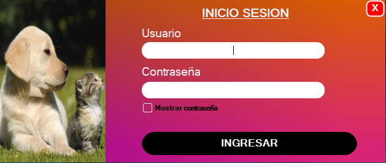
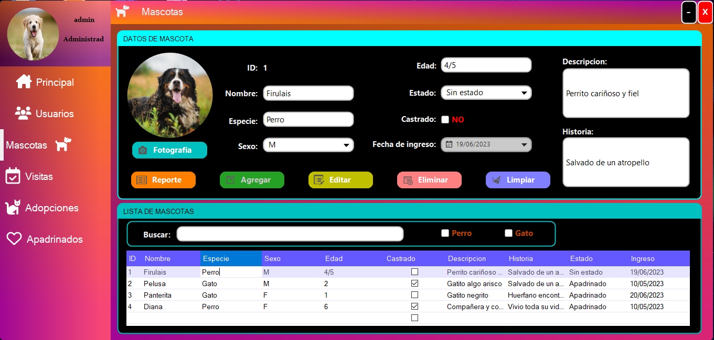
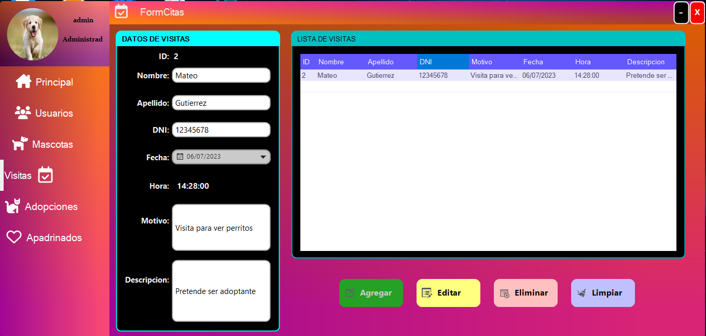
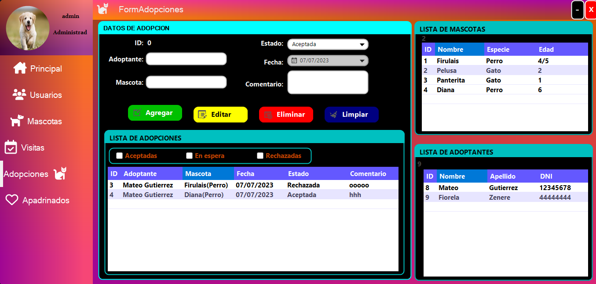
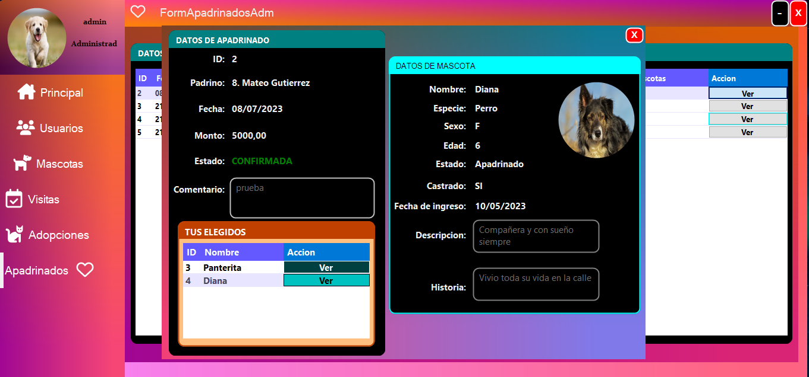
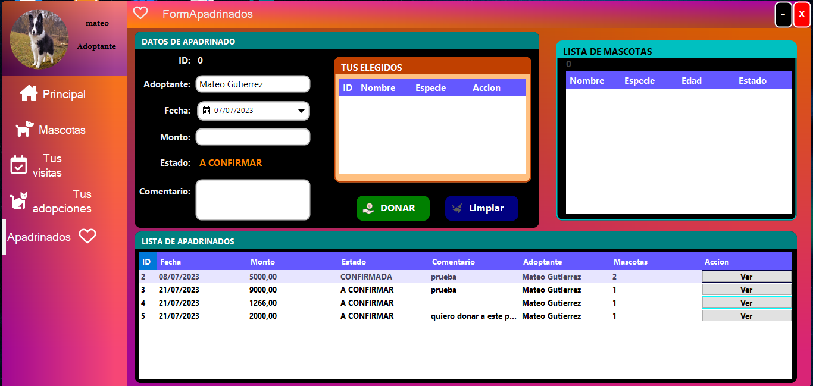
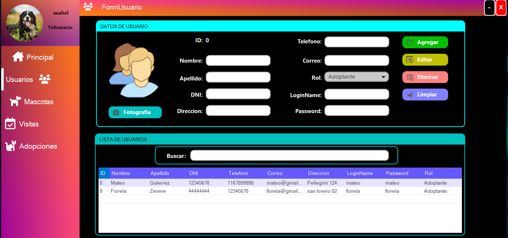
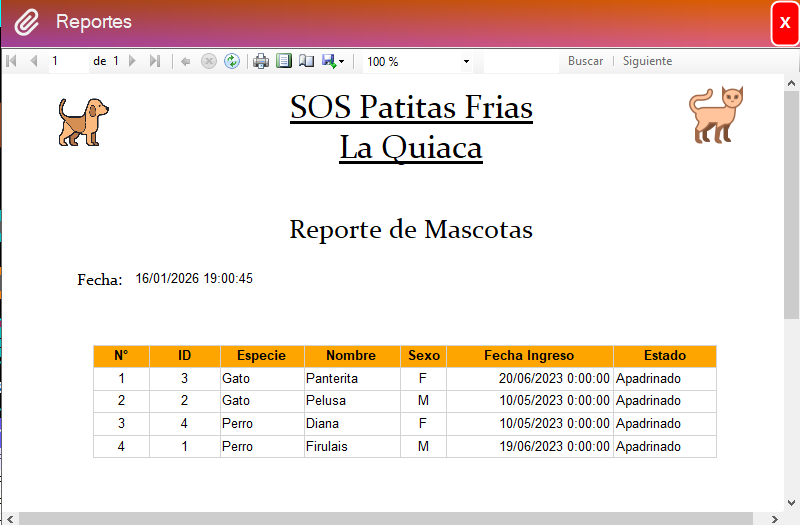

# 🐾 Pet Adoption Management System

Desktop application developed in C# (.NET Framework) to manage the full adoption process in an animal shelter.

This project was created as part of a university course and focuses on **business logic, role-based access and database interaction**.

---

## 👥 User Roles

### 🔑 Administrator
Full system access:
- Users management
- Pets management
- Visits registration
- Adoptions management
- Donations / Sponsorships (Master-Detail)
- Reports generation

### 🧑‍🤝‍🧑 Volunteer
Operational access:
- Register and update users
- Register and update pets
- Register shelter visits

### 🏠 Adopter
Limited access:
- View available pets
- View personal visit history
- View personal adoption history
- Sponsor pets by donating a selected amount

---

## 🧩 Main Features

- Role-based authentication and authorization
- CRUD operations for core entities
- Adoption and visit tracking
- Sponsorship system using Master–Detail pattern
- Reports for pets and adoptions
- Desktop UI with multiple functional modules

---

## 🛠 Technologies Used

- C#
- .NET Framework
- Windows Forms
- SQL Server
- Visual Studio

---

## 📌 Notes

This project prioritizes **functional completeness and business logic** over UI design.  
Future improvements could include:
- Code refactoring and separation of concerns
- Improved UI/UX
- Migration to .NET 8
- Improved validation and error handling

---

## 📸 Screenshots

### 🔐 Login

### 🐶 Pets Management (CRUD)

### 📅 Shelter Visits

### ❤️ Adoptions

### 💰 Sponsorship / Donations

### 🏠 Adopter View

### 🤝 Volunteer View

### 📊 Reports

